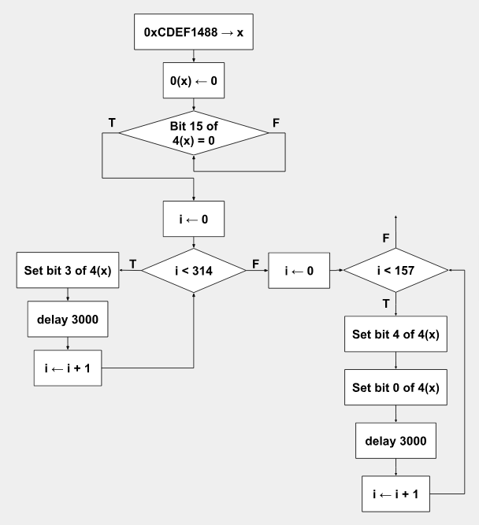

### Alias: corbato

# Homework 2 Robot

CFG:



Bit 15 of 4(x)?

Need to be more specific - Set bit n of 4(x)

Code:

```
init:   li    $t0, 0xCDEF1488    # t0 <- addr of arm controller
        sw    $zero, 0($t0)      # initialize arm: 0xCD..88 <- 0

LReady: lw    $t1, 4($t0)        # t1 <- arm addr 0xCD..8C
        andi  $t2, $t1, 0x8000   # t2 <- get bit 15 of arm
        # Correction: 0x7fff, set bit 13 == 0 => clear it

        bne   $t2, $zero, LReady # iterate if arm is not ready

LR_end: addi  $t2, $zero, 0      # t2 <- 0 
        ori   $t3, $t1, 0x0008   # t3 <- set finger 3 of arm
LIndex: slti  $t4, $t2, 314      # t4 <- 1 if t2 < 314, else t4 <- 0
        beq   $t4, $zero, LI_end # exit LIndex if finger moved fully
        sw    $t3, 4($t0)        # move index finger by .01r
        delay 3000               # motor keepup
        addi  $t2, $t2, 1        # t2 <- t2 + 1
        j     LIndex             # iterate

LI_end: addi  $t2, $zero, 0      # t2 <- 0
        ori   $t3, $t1, 0x0010   # t3 <- set finger 4 of arm
        ori   $t4, $t1, 0x0001   # t4 <- set finger 0 of arm
LHalf:  slti  $t5, $t2, 157      # t5 <- 1 if t2 < 157, else t5 <- 0
        beq   $t5, $zero, LH_end # exit LHalf if fingers moved halfway
        sw    $t3, 4($t0)        # move thumb by .01r 
        sw    $t4, 4($t0)        # move pinky by .01r
        delay 3000               # motor keepup
        addi  $t2, $t2, 1        # t2 <- t2 + 1
        j     LHalf              # iterate

LH_end: ...
```
