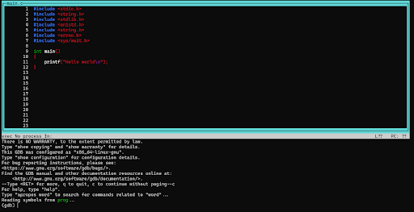
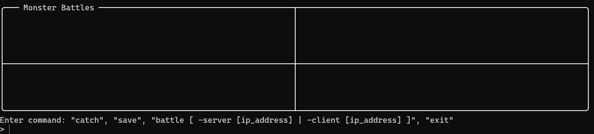
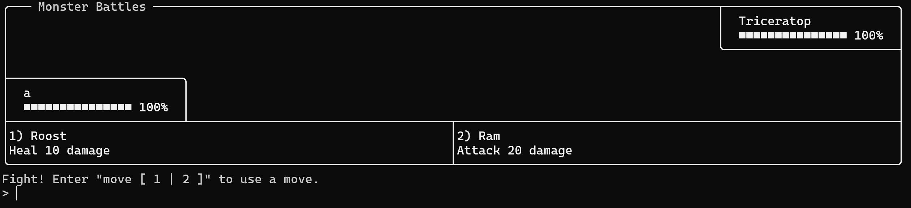

# **Monster Battles**

## **Members**

Rafayet Hossain and Jeffrey Jiang
        
## **High level description of the project**

The final goal of the project is a turn-based battle game. The general idea is players can use monsters they captured to fight others like Pokemon. The main focus will be to allow players to battle one another using their monsters through networking. The battle mechanics will not be fleshed out until the major goals of the project have been implemented. The program will be primarily composed of two sections: a text-based user interface (TUI) for rudimentary graphics and a console section for user input. The TUI and console will be rewritten to display any updates like player actions. The console section accepts input and commands from the player. One such command may be that they will be able to “catch” monsters and put them on their team. Additionally, the players will be able to save their progress and the monsters they have captured in persistent save files that can be loaded. There will also be additional quality of life features such as signal interception to ensure that a player’s progress is not lost. Once these main features are complete, the game can be further fleshed out and expanded.

## **A description as to how the project will be used (describe the user interface).**

The program is completely terminal-based. A player will execute the program in the terminal. From that point, the user will choose which save they want to load through an input. All user input will be taken through `stdin` similar to the command line. Once the save is loaded, the user is greeted with a text-based user interface (TUI) along with a command line interface. The TUI will provide rudimentary graphics and the command line interface provides instructions and accepts input from the user (similar to `gdb -tui` shown below). The player can follow the instructions provided by the interface to use commands. The user can also save their progress. ~~Additionally, signals will be intercepted to ensure that a player’s progress is not lost.~~


  
## **A description of your technical design:**
   
### **How will you be using the topics covered in class in the project?**

The project will especially focus on networking through the use of sockets. This is used to connect two players together to battle. The project will also use topics such as serialization and deserialization from the data file/csv assignment. This process will inherently involve working with files and finding information about those files. Additionally, signals will be intercepted to ensure that the program exists in an acceptable state. Finally, these topics will likely use dynamic memory allocation in some manner.
     
### **How are you breaking down the project and who is responsible for which parts?**

- [x] Basic socket connection - Rafayet
- [x] Text-based user interface library - Jeffrey
- [x] Work on MVP (Tic-tac-toe using socket connection and TUI) - Jeffrey and Rafayet
- [x] Components and functions involved in turn-based game (e.g. `struct Player`, `struct Monster`, etc) - Jeffrey and Rafayet
- [x] Save files (serialization and deserialization) - Jeffrey
- [x] ~~Signal handling - Rafayet~~
- [x] Implementation of turn-based battle game - Jeffrey and Rafayet


### **What data structures will you be using and how?**

`struct`s will be crucial to our project in not only organization, but also in serialization and deserialization. Arrays will be used a lot in buffers and to store collections of data. ~~Usage of other data structures such as a linked list and hashmap is uncertain at this time.~~

Update: A queue is used as part of the TUI implmentation that stores instructions for drawing the TUI. This queue is implemented using a simple doubly-linked list.
     
### **What algorithms will you be using and how?**

There is no specific algorithm we have in mind that we will be using for the project. However, if the situation arises where we could use an algorithm, we will.
    
### **A timeline with expected completion dates of parts of the project.**

- **January 6** – Basic socket connection between two users is tested and finished
- **January 6** – TUI library is finished
- **January 9** – Minimal viable product, a TUI of tic-tac-toe between two users, is complete.
- **January 11** – Basics of the game is completed (e.g. `struct` and functions - representing the components of the game); command to catch “pokemon.”
- **January 12** – Save files implemented
- **January 13** – Implementation of the PvP battle between two users using socket connection
- **January 17** – Quality of life changes such as ~~signal handling~~ or other improvements

# How to build and run the project

Build the main program using the following command:

```
make compile
```

Run the main program:

```
make run
```

# How to use the program

When you first run the program, you will be introduced with a window displaying your party which should be empty. Instructions on allowed commands are displayed below the window. 



Once you have caught some monsters using the `catch` command, you can initiate a battle with another player. This is done with the following commands. If you want to allow a player to battle with you, use:

```
battle -server [ip_address]
battle -s [ip_address]
battle -s 
```

`battle -s` will use the user's IP address by default. For a player to connect to you, you have to call the following:

```
battle -client [ip_address]
battle -c [ip_address]
```

Make sure the IP you connect to already has a server running. It an error to connect to a player who has not called `battle -server`. Additionally, it is an error for two players to call `battle -server` on the same IP address. 

Once a connection has been established, the players will be greeted with the battle screen. Here they will follow the command until the battle is completed. Upon completion, the players will return back to the party screen.



The player can save using the `save` command. Finally, they can also exit the game using the `exit` command which also saves their progress.

# Known Bugs

- Depending on the device, there may be errors thrown such as a "double free" error. This does not happen on Jeffrey's device or on the Marge server, but it occurs on Rafayet's device. 
- There is a bug with the battle desynchronizing between the two players when a heal move is used by a player. Since the main focus of the project is not on the battle mechanics, this is not viewed as important to fix.
